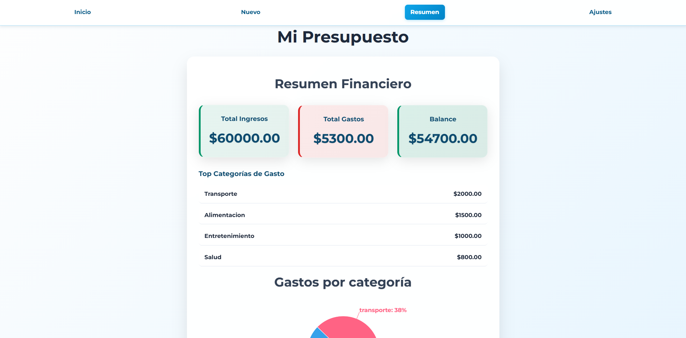
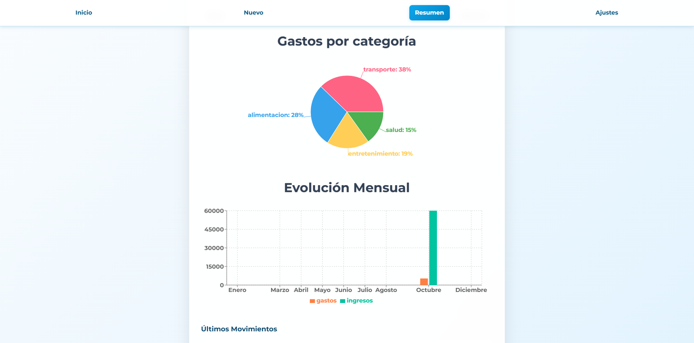
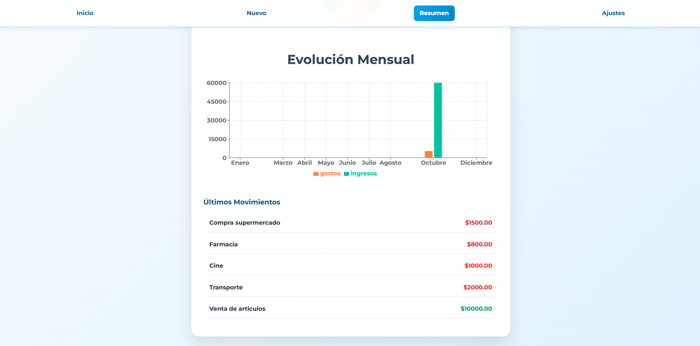
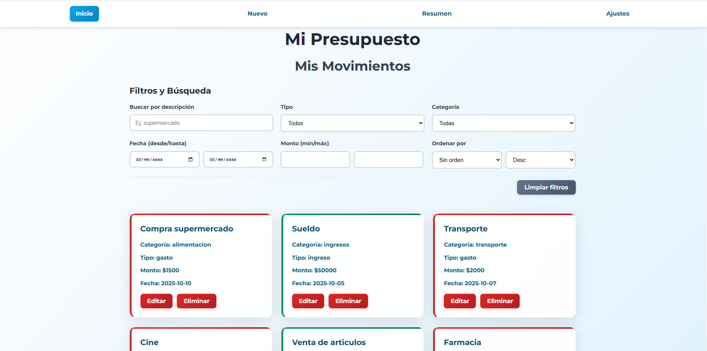
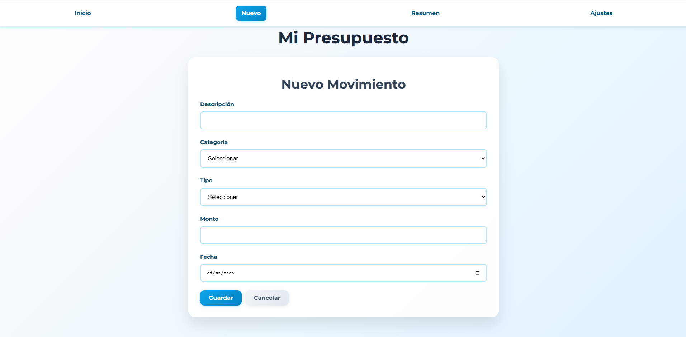
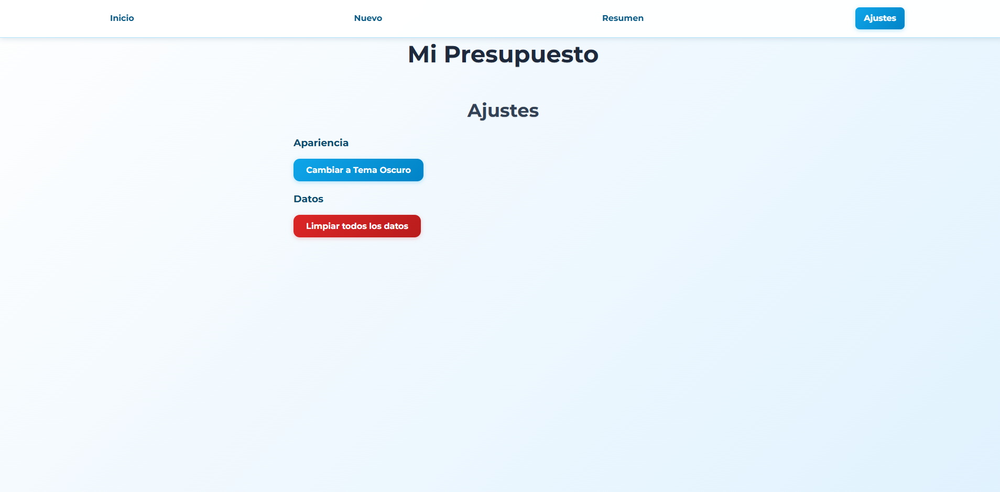

# MI PRESUPUESTO GRILLE LUCERO

## DESCRIPCION DEL PROYECTO

Esta aplicación web permite a los usuarios gestionar sus finanzas personales de manera sencilla y efectiva. Incluye funcionalidades para registrar ingresos y gastos, visualizar estadísticas, gráficos de evolución mensual, y más.

## CARACTERISTICAS PRINCIPALES

- Registro de Movimientos: Agregar, editar y eliminar ingresos y gastos.
- Categorización: Organizar movimientos por categorías (alimentación, transporte, ingresos, etc.).
- Estadísticas en Tiempo Real: Visualizar balance, ingresos totales, gastos totales y categorías más gastadas.
- Gráficos Interactivos: Evolución mensual de finanzas con gráficos de barras.
- Interfaz Responsiva: Diseñada para funcionar en dispositivos móviles y de escritorio.
- Persistencia de Datos: Almacenamiento local para guardar datos sin necesidad de backend.

## TECNOLOGIAS UTILIZADAS

- Frontend: React 19, React Router DOM
- Gráficos: Recharts
- Formularios: Formik, Yup (validación)
- Lenguaje: JavaScript
- Estilos: CSS Personalizado
- Almacenamiento: LocalStorage

### PASOS DE INSTALACION

Antes que nada la instalacion de Node.js

1. **Clona el repositorio**:
   git clone (https://github.com/48313612/MI_PRESUPUESTO_GRILLE_LUCERO.git)
   cd MI_PRESUPUESTO_GRILLE_LUCERO

2. **Instalar dependencias**:
   npm i

3. **Ejecuta la aplicación**
   npm run dev

4. **Abre tu navegador** y presiona CONTROL y haz click en el **http://localhost:5173/**.
   Este mismo se abrirá automáticamente en tu navegador (Chorme, Miscrosoft Edge).

## USO

- Página de Resumen: Vista general con estadísticas, evolución mensual y últimos movimientos.
- Página de Listado: Lista completa de movimientos con filtros por texto, tipo y categoría.
- Agregar Nuevo Movimiento: Formulario para registrar ingresos o gastos.
- Editar Movimiento: Modificar detalles de movimientos existentes.
- Ajustes: Restablecer datos o gestionar configuraciones.

## ROLES DE CADA INTEGRANTE

-   Eugenia: Desarrolladora Frontend, encargado de componentes UI y UX
-   Lola: Desarrolladora Backend, manejo de estado y lógica

### EXPLICACION Y MUESTRA DE PANTALLAS 

### Pantalla Principal (Resumen)
    
    
    
    Vista del dashboard con estadísticas y gráfico de evolución.

### Lista de Movimientos
    
    Página de listado con filtros por nombre del movimiento, categoria y tipo.

### Formulario de Nuevo Movimiento
    
    Proceso de cargar un nuevo movimiento al listado.

### Formulario de Nuevo Movimiento
    
    Página destinada a modificar la apariencia y/o datos.
    

## LINK A DEPLOY
    https://mi-presupuesto-grille-lucero.vercel.app/

##LINK A DRIVE - VIDEO EXPLICATIVO
   https://drive.google.com/file/d/10Ui3LL6IYD2-XxGUgFuF2PZnLXaf6SDU/view?usp=sharing
